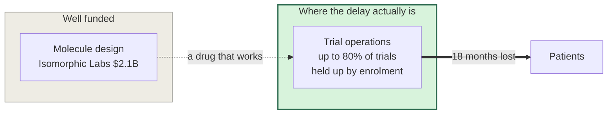
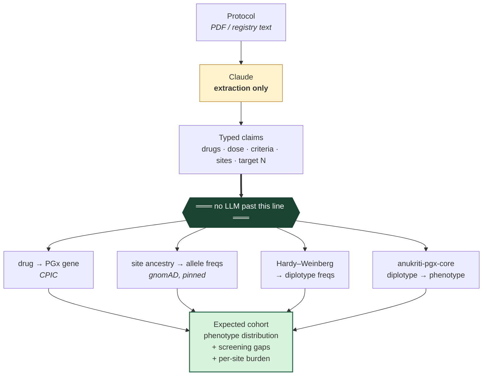
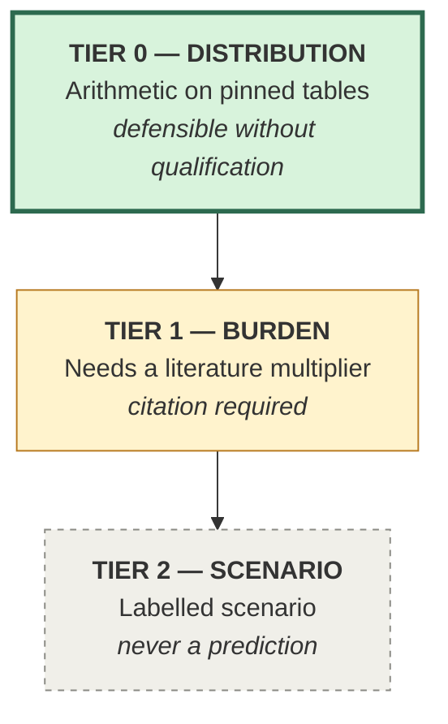
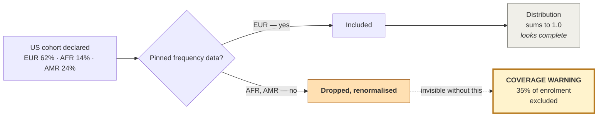

# Slide deck — content and diagram specs

Push to Prod, 2026-08-08. 10 slides, ~3 minutes. Every number here is verified
and traceable; derived findings are marked as ours.

---

## Slide 1 — Title

> # cohortfit
> ### Every trial protocol has an implicit genome it was written for.
> ### Nobody checks whether the patients you're enrolling actually have it.
>
> Genomic feasibility auditing for clinical trial protocols
> Built on `anukriti-pgx-core` · 13 genes · 22 pinned CPIC tables

**Visual:** DIAGRAM A (hero).
**Say:** "A protocol's dose was calibrated on a population. Run it somewhere else and a computable fraction of enrollees can't metabolise it."

---

## Slide 2 — The problem is operational, not scientific

- **Up to 80% of trials** are held up by enrolment
- ICON plc (CRO, 40,200 staff) signed a multi-year deal with Anthropic on 2026-07-28 — aimed at **site intelligence, study feasibility, protocol optimization**
- Their Ireland/UK head, Pip White: *"Far too often, the barrier to getting medicines to patients faster is operational, not scientific."*
- Isomorphic Labs raised **$2.1B** chasing the molecule. Almost nothing is chasing the eighteen months a trial loses finding the right patients.

**Visual:** DIAGRAM B (two-lane).
**Say:** "The molecule lane is funded and crowded. Anthropic pointed its first big pharma deal at operations."

---

## Slide 3 — What goes wrong, concretely

DPYD clears fluoropyrimidine chemotherapy (capecitabine, 5-FU). Broken copies → the drug accumulates → severe, sometimes fatal toxicity.

- **10–30%** of patients on standard doses develop severe toxicity
- **0.5–1%** die of it (up to 5% in the elderly)
- **EMA (Apr 2020)** and **MHRA/NHS England (2020)** *require* pre-treatment DPD testing. Complete deficiency is a **contraindication**.

So a capecitabine protocol with no DPYD criterion isn't merely off-guideline — it's inconsistent with the approved EU/UK label.

**Visual:** none. Let the three numbers land.

---

## Slide 4 — Architecture: the model extracts, arithmetic decides

**Visual:** DIAGRAM C (pipeline) — the load-bearing slide.

- Claude converts protocol prose into typed claims. **That is all it does.**
- Everything downstream is Hardy-Weinberg arithmetic over pinned gnomAD frequencies and pinned CPIC diplotype tables
- `models.py` encodes the boundary **as types** — extraction side vs verdict side — so it's enforceable, not aspirational
- Offline by default. Any number in a report can be re-derived by hand.

**Say:** "Claude is good at pulling structure out of prose. It's exactly the wrong thing to ask 'is 27% correct?' — so we never ask it."

---

## Slide 5 — Output contract: tiers and refusal

| Tier | Claim | Basis |
|---|---|---|
| **0** | Expected cohort phenotype distribution | Arithmetic on pinned tables. Defensible without qualification. |
| **1** | Excess toxicity burden | Needs a literature multiplier. **Citation required.** |
| **2** | Trial-outcome impact | Labelled **scenario**. Never a prediction. |

Verdicts: `ACTIONABLE` · `CONTESTED` · `NO_SIGNAL`

**`CONTESTED` is a real answer, not a hedge.** When the literature genuinely disagrees, the tool shows the disagreement instead of picking a number.

**Visual:** DIAGRAM D (tier ladder).

---

## Slide 6 — The finding (ours, derived, reproducible)

> ## 94.2%
> of the South Asian actionable DPYD burden rests on **one allele**: HapB3.
>
> And HapB3 is precisely the allele whose dose action **CPIC itself contests.**

- Leave-one-out ablation over our pinned fixture. Effective allele count: **1.12** for SAS vs **2.10** for EUR. `*13` never fires in SAS at all.
- CPIC's own guideline page flags PMID 37639651: HapB3 carriers at the standard 25% reduction showed **reduced effectiveness *and* increased toxicity**
- Set HapB3 aside as contested and number-needed-to-screen goes **28 → 487** in SAS. In Europeans, 16 → 43.

**The population with the most concentrated risk is concentrated on the allele with the weakest dosing evidence.** We have not seen this stated anywhere.

**Visual:** DIAGRAM E (ablation bars).

---

## Slide 7 — And the honest limit on that claim

DPYD is an **outlier**, not a general law. Effective-allele ratio EUR/SAS:

| Gene | Ratio |
|---|---|
| SLCO1B1 | 1.00× |
| TPMT | 1.06× |
| CYP2C19 | 1.07× |
| CYP2C9 | 1.17× |
| **DPYD** | **1.87×** |

The generalisable claim is the **mechanism**: panel fragility scales inversely with total variant load. Rare-variant panels are exposed where high-load panels are buffered.

CYP2C19 `*2` is ~2.1× *higher* in South Asians — the asymmetry runs both ways.

**Say:** "We checked whether this generalises. It doesn't, and we'd rather say so than get caught."

---

## Slide 8 — Every known bias makes our number too low

| Source | Effect | Magnitude |
|---|---|---|
| Consanguinity (`q² + Fpq`) | PM undercounted | ~2.3× homozygotes |
| `*2A` exome undercount | IM+PM undercounted | up to 1.41× |
| Genotype-invisible deficiency | at-risk undercounted | ~8.8% of deficient patients (n=712) |

None push the other way. And the tool says so at runtime:

- **35%** of a US cohort's enrolment has no pinned data → the report **names it** rather than quietly returning European numbers
- `*13` at 0.0 reports as *"not detected in 91,074 alleles, upper bound 0.0033%"* — not as absence
- The one pinned value we don't trust carries a warning with the **direction** of the error

**Visual:** DIAGRAM F (coverage gap).
**Say:** "A distribution that renormalises a missing population still sums to 1.0 and looks complete. Silence there is the bug."

---

## Slide 9 — It runs, and it discriminates

**Live:** `https://cohortfit.anukritiai.com`

Four pinned protocols, each exercising a different path:

| Protocol | Result |
|---|---|
| 2 Indian sites + Munich | Munich **6.40%** vs Mumbai **3.55%** at-risk — 1.80× on ancestry alone |
| 100% South Asian, unscreened | `ACTIONABLE` + `CONTESTED` |
| US multi-ancestry | `ACTIONABLE` + **coverage warning** |
| DPYD-screened per EMA | **`NO_SIGNAL`** |

That last row matters: **the tool does not simply always accuse.**

**236 tests** · ruff clean · offline by default · Apache-2.0

**Visual:** screenshot of the dataset cards + one report. Real UI beats a diagram here.

---

## Slide 10 — Why this is infrastructure

- **Scale:** one rule per CPIC Level A pair — **~43–53** of them, across 34 genes and 164 drugs of CPIC guideline coverage
- **Adoption path:** accept **CDISC USDM / ICH M11**, the machine-readable protocol standard. We slot into a pipeline sponsors and CROs are already being pushed toward.
- **Regulatory tailwind:** ICH E17 makes *intrinsic ethnic factors* a consistency requirement. Japan and China mandate local testing or ethnic-sensitivity analysis; India's waiver is contested on exactly these grounds.
- **Cost of the status quo:** a substantial protocol amendment runs **$141k (Ph II) / $535k (Ph III)**, and 76% of protocols now need one.

> **Isomorphic raised $2.1B to design the molecule. Anthropic's own partner says 80% of trials are held up by operations, not science.**
> **We built the layer that tells you whether the population you're enrolling can metabolise the molecule you already have.**

---

# Diagram specs

## First, a recommendation

**Do not use an AI image generator for diagrams C, D, E, F.** They contain
precise labels and numbers, and image models garble text. Use **Mermaid** (renders
in GitHub, Notion, most slide tools) or **Excalidraw** for those — sources below,
copy-paste ready.

Use AI generation **only for DIAGRAM A**, the conceptual hero image, where there
is no text to get wrong.

---

## DIAGRAM A — Hero (AI image generation)

**Prompt:**

> A wide cinematic editorial illustration, muted cream and deep forest green
> palette with soft mint accents. On the left, a stack of clinical trial protocol
> documents rendered as clean paper sheets. On the right, a translucent DNA double
> helix made of fine glass. Between them, thin luminous threads connect specific
> paper lines to specific rungs of the helix — most threads connect cleanly, but
> a few threads visibly miss the helix and fade into empty space. Minimalist,
> generous negative space, no text, no words, no letters anywhere. Flat editorial
> vector style with subtle depth, scientific publication aesthetic, not
> photorealistic, not corporate stock art.

**Negative prompt:** `text, words, letters, numbers, labels, logos, watermark, people, faces, hands, cluttered, neon, sci-fi, glowing blue hologram`

The missed threads are the whole idea: a protocol calibrated for a genome it
won't actually recruit.

---

## DIAGRAM B — Two-lane (Mermaid)

---

## DIAGRAM C — Pipeline (Mermaid) · the load-bearing diagram

The black bar is the point of the slide. Make it visually heavy.

---

## DIAGRAM D — Tier ladder (Mermaid)

Confidence should visibly *decay* down the ladder — solid to dashed.

---

## DIAGRAM E — Ablation (bar chart, build in slides or Excalidraw)

Horizontal bars, "share of actionable burden", two grouped series:

| Allele | SAS | EUR |
|---|---:|---:|
| HapB3 | **94.2%** | 63.9% |
| c.2846A>T | 2.9% | 19.5% |
| `*2A` | 2.8% | 15.4% |
| `*13` | 0.0% | 0.3% |

Highlight the SAS HapB3 bar in amber (the `CONTESTED` colour) and annotate:
*"CPIC's dose action for this allele is disputed — PMID 37639651"*.

Caption: *Leave-one-out ablation over pinned gnomAD v4 frequencies. Our
derivation, reproducible from `fixtures/frequencies/dpyd.json`.*

---

## DIAGRAM F — Coverage gap (Mermaid)

---

## Palette (matches the product)

| Role | Hex |
|---|---|
| Background | `#f8f7f2` cream |
| Ink | `#1a1a18` |
| Primary / Tier 0 | `#2d6a4f` forest |
| Accent fill | `#d8f3dc` mint |
| Tier 1 / contested | `#b7791f` amber |
| Coverage warning | `#a86a2c` ochre |
| Muted | `#5c5c58` |

Fonts: **Inter** for text, **IBM Plex Mono** for numbers and identifiers.

---

## If you only have time for three diagrams

**C (pipeline)**, **E (ablation)**, **F (coverage gap)**. Those carry the
architecture, the finding, and the honesty — which is the whole argument.
